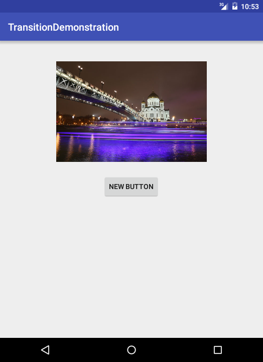
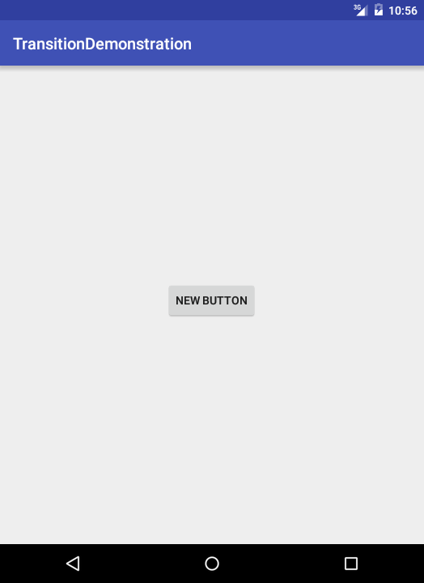

# Transition Demonstration

A simple demonstration of Android transitions.

## Introduction :point_up:

This app shows how the Android slide transition introduced in API 21, Android Lollipop, works. It is based on material gotten from [Udacity](https://www.udacity.com/) [Material Design for Android Developers](https://www.udacity.com/course/material-design-for-android-developers--ud862) online class. Original code can be found in [this](https://github.com/udacity/ud862-samples) repository in the [Transition Demo folder](https://github.com/udacity/ud862-samples/tree/master/TransitionDemo). 

## Version History :package:

**latest**&nbsp;&nbsp;&nbsp;[TransitionDemonstration v1.0.0](https://github.com/joshua-kairu/xml-test/releases/download/v1.0/XML-Test-v1.0.0.apk)&nbsp;&nbsp;&nbsp;Wednesday, June 15, 2016<br/><br/>
This repo tries its best to follow the [Semantic Versioning](http://semver.org/) guidelines.

## How To Use :wrench:

:zero: Start the app. You should see the app looking like this:<br/>

 

:one: Tap on the ```New Button``` button. This should make the image leave to one of the four edges of the screen. This will leave the app looking like this:<br/>

 

:two: Tapping on ```New Button``` again leads to the image coming back from one of the four edges of the screen.<br/>

:three: Have fun making the image leave and return. :smile:<br/>

## Abilities :muscle:

The app can:
* Make an image appear from any of the four edges of the screen.
* Make an image disappear to any of the four edges of the screen.

## Limitations :worried:

The app is just a demonstration. It cannot:
* Make the button be under the image as the image moves around.
* Allow the user to change the image.
* Work below Android API 21, Android Lollipop, since the ```Slide``` transition is available only in that API level going forward. 

## Possible Future Work :fast_forward:

As of Wednesday, June 15, 2016, some future work could be:
- [ ] Make the button be always under the image when the image is in motion.
- [ ] Ensure the image comes and goes from the same direction.

## Other things :books:

Big thanks to:
* Udacity for the original app.
* [Unsplash](https://unsplash.com) for high quality photos.

Apologies for not having a video to illustrate the workings of this app. I have not yet found an API 21 device so I used the emulator. I have subsequently not yet known how to screen record using the emulator. :grin:

## License :lock_with_ink_pen:

This repository is licensed under the [GNU General Public License Version 3](http://www.gnu.org/licenses/gpl-3.0.en.html).
